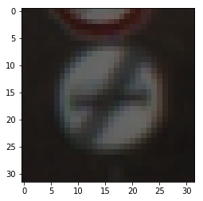
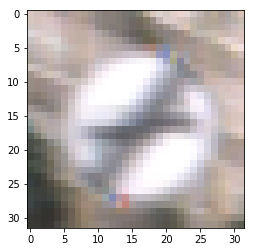
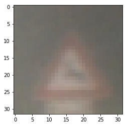
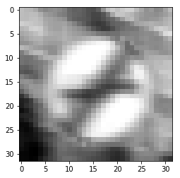
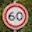
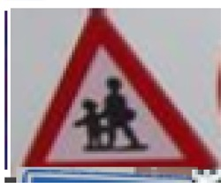
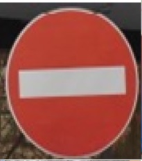
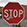

#**Traffic Sign Recognition** 

##Writeup Template

###You can use this file as a template for your writeup if you want to submit it as a markdown file, but feel free to use some other method and submit a pdf if you prefer.

---

**Build a Traffic Sign Recognition Project**

The goals / steps of this project are the following:
* Load the data set (see below for links to the project data set)
* Explore, summarize and visualize the data set
* Design, train and test a model architecture
* Use the model to make predictions on new images
* Analyze the softmax probabilities of the new images
* Summarize the results with a written report

[//]: # (Image References)

[image1]: ./examples/visualization.jpg "Visualization"
[image2]: ./examples/grayscale.jpg "Grayscaling"
[image3]: ./examples/random_noise.jpg "Random Noise"
[image4]: ./examples/placeholder.png "Traffic Sign 1"
[image5]: ./examples/placeholder.png "Traffic Sign 2"
[image6]: ./examples/placeholder.png "Traffic Sign 3"
[image7]: ./examples/placeholder.png "Traffic Sign 4"
[image8]: ./examples/placeholder.png "Traffic Sign 5"

## Rubric Points
###Here I will consider the [rubric points](https://review.udacity.com/#!/rubrics/481/view) individually and describe how I addressed each point in my implementation.  

---
###Writeup / README

####1. Provide a Writeup / README that includes all the rubric points and how you addressed each one. You can submit your writeup as markdown or pdf. You can use this template as a guide for writing the report. The submission includes the project code.

You're reading it! and here is a link to my [project code](https://github.com/anunayarunav/traffic-sign-classifier/blob/master/Traffic_Sign_Classifier.ipynb)

###Data Set Summary & Exploration

####1. Provide a basic summary of the data set and identify where in your code the summary was done. In the code, the analysis should be done using python, numpy and/or pandas methods rather than hardcoding results manually.

The code for this step is contained in the second code cell of the IPython notebook.  

I used the pandas library to calculate summary statistics of the traffic
signs data set:

* The size of training set is 34799
* The size of test set is 4410
* The shape of a traffic sign image is (32, 32, 3)
* The number of unique classes/labels in the data set is 43

####2. Include an exploratory visualization of the dataset and identify where the code is in your code file.

The code for this step is contained in the third code cell of the IPython notebook.  

Here is an exploratory visualization of the data set. It is the plot of a few images from the training dataset just to see how the dataset looks like.

###Design and Test a Model Architecture

####1. Describe how, and identify where in your code, you preprocessed the image data. What tecniques were chosen and why did you choose these techniques? Consider including images showing the output of each preprocessing technique. Pre-processing refers to techniques such as converting to grayscale, normalization, etc.

The code for this step is contained in the fourth code cell of the IPython notebook.

As a first step, I decided to convert the images to grayscale because it didn't matter whether the data was colored or grayscale and the output would still be same. But that would reduce the complexity of training substantially.

Here is an example of a traffic sign image before and after grayscaling.

As a last step, I normalized the image data because ideally we want our data to have zero mean and unit variance (actually same variance), so that the convergence is faster.

####2. Describe how, and identify where in your code, you set up training, validation and testing data. How much data was in each set? Explain what techniques were used to split the data into these sets. (OPTIONAL: As described in the "Stand Out Suggestions" part of the rubric, if you generated additional data for training, describe why you decided to generate additional data, how you generated the data, identify where in your code, and provide example images of the additional data)

The data given for training, validation and testing was used as it was given, and no additional splitting of the data was done. Also no additional data was generated.

####3. Describe, and identify where in your code, what your final model architecture looks like including model type, layers, layer sizes, connectivity, etc.) Consider including a diagram and/or table describing the final model.

I constructed an easy to use modular method to build any desired neural network to train. The method is designed in fifth cell of the ipython notebook. It has been named as "convnet", and it takes "layers" as an input which describes the layers you want to build the network on, apart from other parameters. The code for my final model is located in the seventh cell of the ipython notebook which uses this method to build the network.

My final model consisted of the following layers:

| Layer					|     Description	        					| 
|:---------------------:|:---------------------------------------------:| 
| Input					| 32x32 RGB image   							| 
| Convolution 5x5		| 1x1 stride, valid padding, outputs 28x28x64 	| 
| RELU					|												|
| Dropout				| keep_prob=0.5 								|
| Convolution 5x5		| 1x1 stride, valid padding, outputs 24x24x32 	|
| RELU					|												|
| Dropout				| keep_prob=0.5 								|
| Convolution 5x5		| 1x1 stride, valid padding, outputs 20x20x16 	|
| RELU					|												|
| Dropout				| keep_prob=0.5 								|
| Max pooling			| 2x2 stride,  outputs 10x10x16 				|
| Flatten				| outputs 1600x1								|
| Fully connected		| weights 1600x400 outputs 400x1				|
| RELU					|												|
| Dropout				| keep_prob=0.5 								|
| Fully connected		| weights 400x160 outputs 160x1					|
| RELU					|												|
| Dropout				| keep_prob=0.5 								|
| Fully connected		| weights 160x84 outputs 160x1					|
| RELU					|												|
| Dropout				| keep_prob=0.5 								|
| Fully connected		| weights 84x43 outputs 43x1					|
| Softmax				| 												|
|						|												|
|						|												|
 

####4. Describe how, and identify where in your code, you trained your model. The discussion can include the type of optimizer, the batch size, number of epochs and any hyperparameters such as learning rate.

The code for training the model is located in the eigth cell of the ipython notebook. It calls a method called train_model, which is defined in 6th cell. 

This method uses "AdamOptimizer", to minimize the softmax cross-entropy loss along with l2 regularization. The model is trained with 15 epochs, initial learning rate being 0.0001 which was reduced by 95% after every epoch. Regularization constant was 1e-3. Batch size was 128.  

####5. Describe the approach taken for finding a solution. Include in the discussion the results on the training, validation and test sets and where in the code these were calculated. Your approach may have been an iterative process, in which case, outline the steps you took to get to the final solution and why you chose those steps. Perhaps your solution involved an already well known implementation or architecture. In this case, discuss why you think the architecture is suitable for the current problem.

The code for calculating the accuracy of the model is located in the ninth cell of the Ipython notebook.

My final model results were:
* training set accuracy of 99.6%
* validation set accuracy of 95.1%
* test set accuracy of 97.0%

The model was found using an iterative approach. First I implemented a logistic regression just to set up a benchmark on the problem. Then, after trying the standard lenet5 architecture, I modified the complexity of the architecture a few times to see how the problem works out. Initially the learning rate was a bit high, so model was not working quite well. I reduced it by a factor of 10, and after using the normalized data the model was giving a decent score. However the gap between traning and valiadation error was quite large, indicating some overfit. Also the accuracy was fluctuation so annealing was done. I added a dropout layer after every non linear operation and afterwards both the errors got close and model gave much higher accuracy.

###Test a Model on New Images

####1. Choose five German traffic signs found on the web and provide them in the report. For each image, discuss what quality or qualities might be difficult to classify.

The first image might be difficult to classify because we have 60km/h in the image which might be confused with 80km/h.

The second image has children crossing, which might be confused with road work or general caution because they have similar signs.

Also second and third images do not have 32x32px size, in fact they have to be resized in order to be passed through the model. This might add another level of difficulty as resizing them might not preserve the dimensions network has learned to work with.

The fourth and fifth signs looks shouldn't have much trouble to be classified other than the noise in the background.

####2. Discuss the model's predictions on these new traffic signs and compare the results to predicting on the test set. Identify where in your code predictions were made. At a minimum, discuss what the predictions were, the accuracy on these new predictions, and compare the accuracy to the accuracy on the test set (OPTIONAL: Discuss the results in more detail as described in the "Stand Out Suggestions" part of the rubric).

The code for making predictions on my final model is located in the tenth cell of the Ipython notebook.

Here are the results of the prediction:

| Image			        |     Prediction	        					| 
|:---------------------:|:---------------------------------------------:| 
| 60_kmh.jpg			| Speed limit (60km/h)							| 
| children_crossing.jpg	| Children crossing 							|
| no_entry.jpg			| No entry										|
| stop.jpg				| Stop							 				|
| yield_sign.jpg		| Yield 							|

The model was able to correctly guess 5 out of the 5 traffic signs, which gives an accuracy of 100%. This compares favorably to the accuracy on the test set of 96.6%, which itself is quite high.

####3. Describe how certain the model is when predicting on each of the five new images by looking at the softmax probabilities for each prediction and identify where in your code softmax probabilities were outputted. Provide the top 5 softmax probabilities for each image along with the sign type of each probability. (OPTIONAL: as described in the "Stand Out Suggestions" part of the rubric, visualizations can also be provided such as bar charts)

The code for making predictions on my final model is located in the 11th cell of the Ipython notebook.

For the first image, the model is very sure about the image as being the "60km/h" sign, with 0.99. The top five soft max probabilities were

| Probability         	|     Prediction	        					| 
|:---------------------:|:---------------------------------------------:| 
| .99					| Speed limit (60km/h)							| 
| .00024				| Speed limit (80km/h)							|
| 0.00018				| No passing									|
| 6.68935e-05			| Ahead only									|
| 3.08211e-05			| No passing for vehicles over 3.5 metric tons	|

For the second image too model is almost sure of the image being of "Children crossing", with probability 0.93.

| Probability         	|     Prediction	        					| 
|:---------------------:|:---------------------------------------------:| 
| 0.938519				| Children crossing								| 
| 0.021467				| Beware of ice/snow							|
| 0.0201704				| Road narrows on the right						|
| 0.007172				| Pedestrians									|
| 0.005936				| Bicycles crossing								|

For the third image too the model is very sure of it being a "No entry" sign with probability 0.99.

| Probability         	|     Prediction	        					| 
|:---------------------:|:---------------------------------------------:| 
| 0.999784				| No entry										| 
| 0.000211				| Stop											|
| 1.88605e-06			| Turn left ahead								|
| 1.06194e-07			| Speed limit (20km/h)							|
| 5.39954e-07			| Turn right ahead								|

For the Fourth image too the model is very sure of it being a "Stop" sign with probability 0.99.

| Probability         	|     Prediction	        					| 
|:---------------------:|:---------------------------------------------:| 
| 0.999999				| Stop											| 
| 1.03655e-06			| Bumpy											|
| 1.05233e-06			| No entry										|
| 2.81851e-08			| Yield											|
| 1.81811e-08			| Turn right ahead								|

For the fifth image too the model is very sure of it being a "Yield" sign with probability 0.99.

| Probability         	|     Prediction	        					| 
|:---------------------:|:---------------------------------------------:| 
| 0.999991				| Yield											| 
| 6.58819e-06			| Keep left										|
| 1.7501e-06			| Priority road									|
| 1.67416e-07			| No vehicles									|
| 1.42.82e-07			| Ahead only									|

